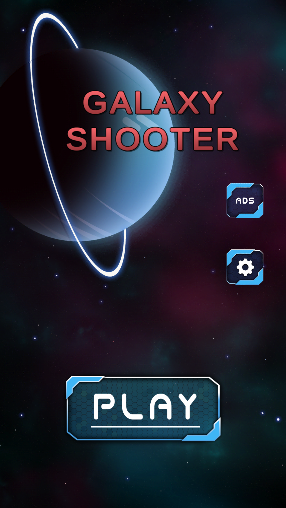
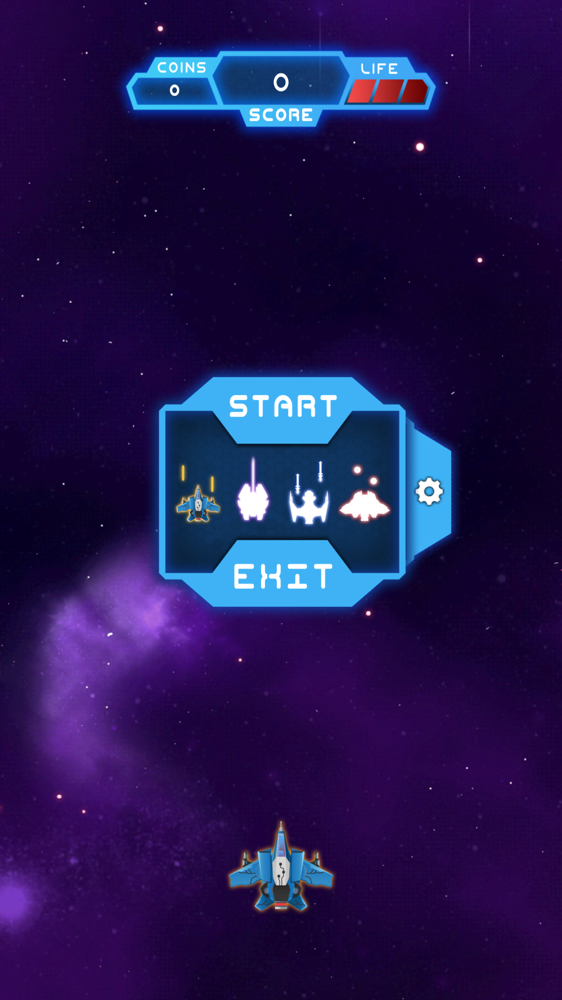
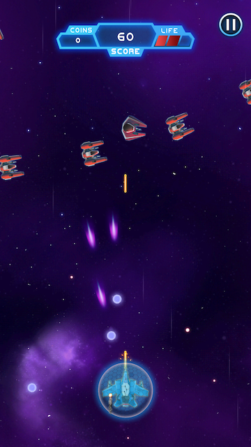

# thanyalukj.github.io

## Galaxy Shooter

## Galaxy Shooter Support
You have 3 lives to shoot the enemies. There are multiple spaceships to choose and also many power up items to collect! Have fun!

## Galaxy Shooter Privacy Policy
Galaxy Shooter is built Using Unity. Please see [Unity's Privacy Policy](https://unity3d.com/legal/privacy-policy) for information about what data is being collected.
